# OutOfOffice

The first launch
-
- Before you run the application for the first time, you need to run the DbCreation SQL script located in the main folder of the repository, it will create a database with the entities and relationships shown in the diagram below.
 
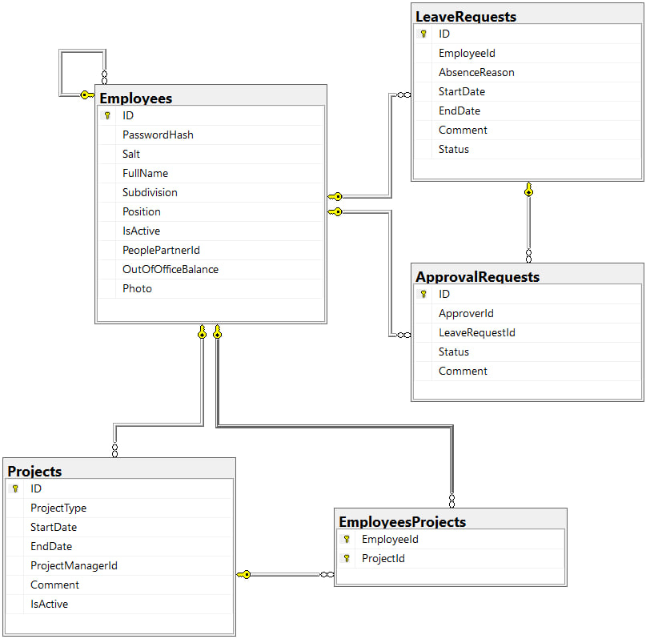
 
 
 

- After that, you need to run the programme. When launching the program for the first time, you need to create the first administrator who will be able to add the first users. This can be done by clicking on the link at the bottom of the authorisation form (the programme will automatically redirect to the form page if the user is not authorised)
 
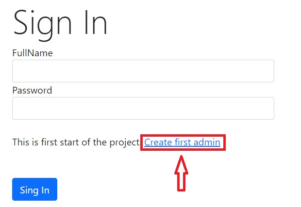
 
 
 

- By clicking on the link, a form for registering the first administrator will appear where the user must enter a full name, come up with a strong password (the password must consist of at least 6 characters, containing at least one lowercase letter, one uppercase letter and one number), and optionally add a photo.
 
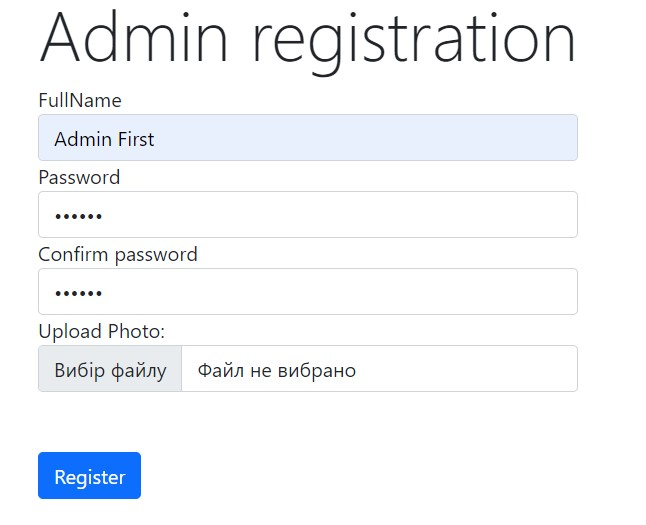
 
 
 

- After the first administrator is successfully created, the form for registering an administrator becomes unavailable, and in the future any users must be created by the administrator, including other administrators. To create the first users, first go to the home page by clicking on the corresponding button:
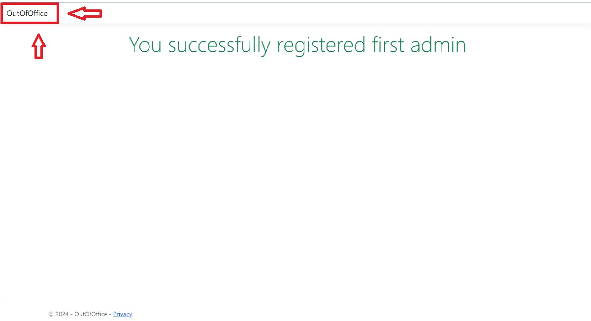
 
 
On the home page, you will see a welcome message by the name of the authorised user and a button to log out of the account. At the top of the navigation bar, you will see all the lists available for navigation depending on the user's role. We go to the Employees list to create new users
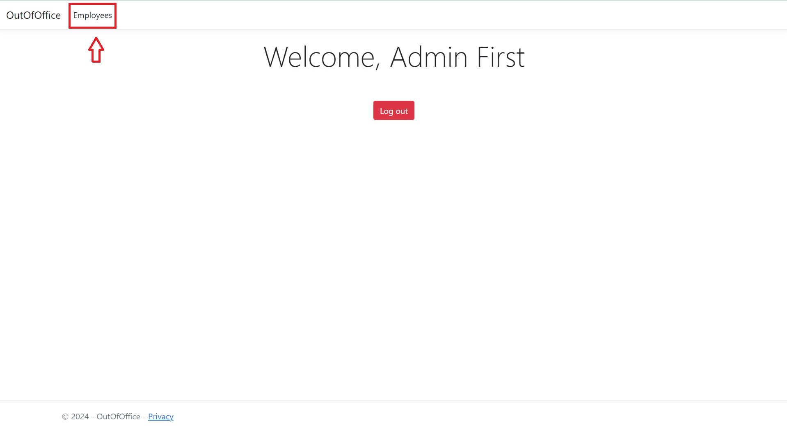
 
 
Clicking on the link, you will see a table with all users. At the top is the button "Add new employee +". 
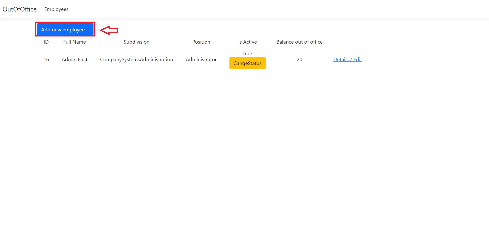
 
 
The form for creating a new user opens.  
<b>Important!</b> When the first HR manager is created, all other users (other than the newly created employee) receive his/her ID as PeoplePartnerId (it is recommended that the first new employee to create an HR manager is the first to do so).
 
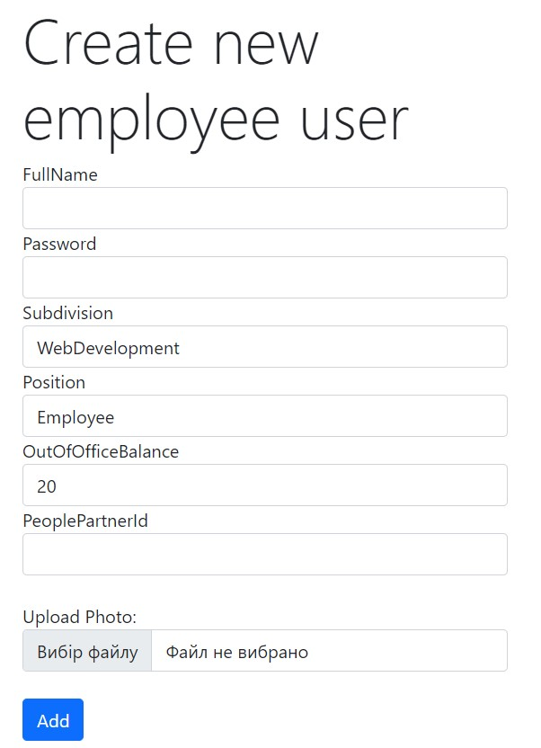
 
 
 

General rules
------------------------------------------------
- Employees have different access to information depending on their role. All available lists for viewing are located in the top navigation menu, as shown in the photo
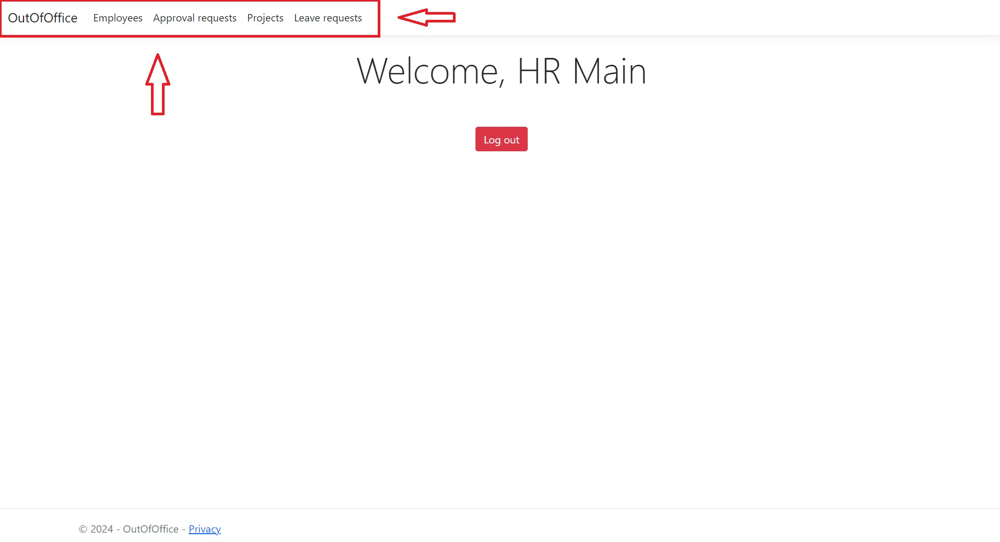
 
 
 

- Lists are uniform tables that can differ in content depending on the access to the data. An example of a list of employees for the HR position:
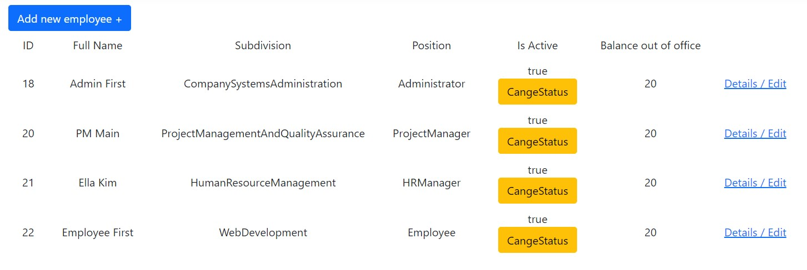
 
 
By default, all tables are sorted by the ID column, if necessary, you can sort the table by any other column by clicking on its name in the table header, if you click again, the table is re-sorted in the reverse order
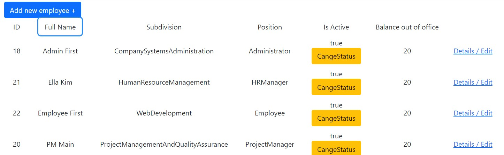
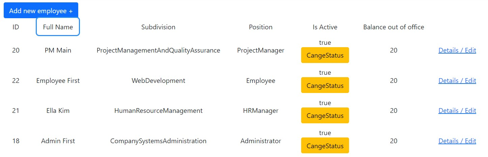
 
 
If it is possible to create an item for the current list directly and the user has the appropriate rights, there will be a button for creating it at the top of the table. For example, the button "Add new employee +" as in the photo
 
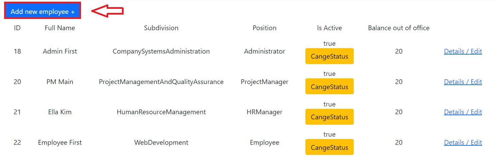
 
 
- The Leave requests list is the same for all roles. Going to it, you will see a table with all your leave requests. Directly in the table, you can approve a new request, the status changes to "Submit" and requests for approval are created for the HR manager and project managers in which you are involved. You can also cancel the request, the status changes to "Cancel" and the approval requests are deleted, if any. You can perform these operations by clicking the corresponding buttons in the status column. You can also create a new request by clicking the corresponding button above the table or edit existing requests by clicking on the amplification in the last column of the desired request line
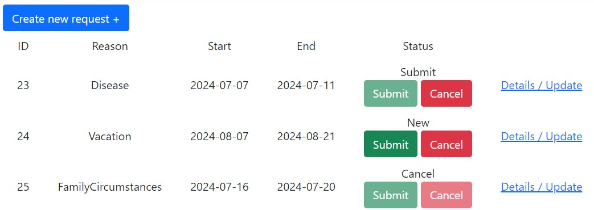
 
 
- The Approvals to my leave requests list is common to all roles and represents a list of approval requests for all leave requests for a given user, where the request and leave details, Approver name and current status of the response are displayed. You can also view the details by clicking on the link in the last column
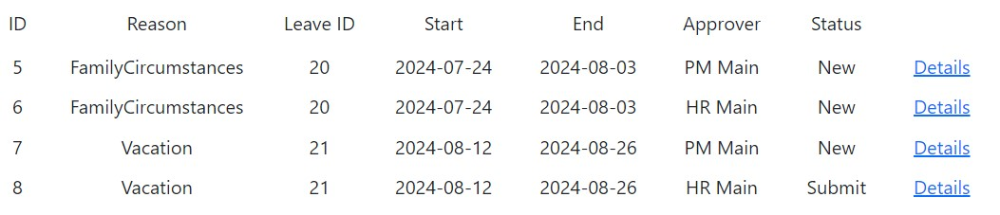
 
 
 

HR Manager role
----------------
When logged in as an HR Manager, the following lists are available: Employees, Approval requests, Projects, Leave requests and Approvals to my leave requests.
- Going to the Empoyees list, the manager sees all employees subordinated to him or her, can create new ones or edit existing ones. 
 
You can change the employee's status, by click on the yellow button in the corresponding column in the row corresponding to the employee's row.
 
For detailed information and editing of a specific employee, click on the link in the last column of the table in the row corresponding to the employee's row. 
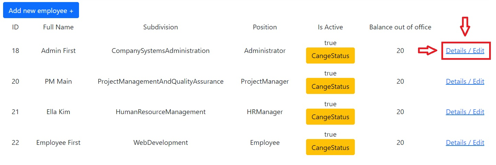
 
 
The HR Manager can only change the Full name, Subdivision, Out of office days balance and add or change photo fields. Other information is read-only
 
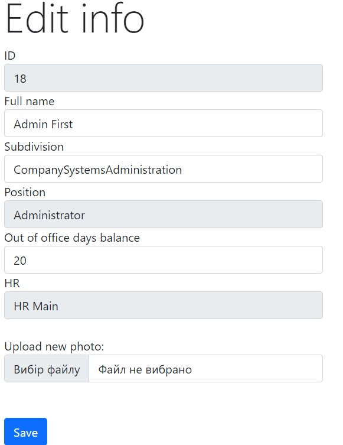
 
 
 
- By going to the Approval requests list, the manager sees all requests for approval of leave requests from all users subordinated to the manager. Right here, you can see the basic information about the leave request and approve it by clicking the corresponding green button in the Status column. Or click on the Details / Refuse link in the last column 
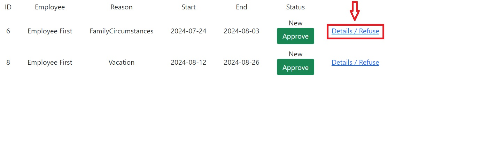
 
 
In the form, you can see all available information, leave a comment if necessary, and approve or reject the request
<b>Important!</b> The request cannot be rejected unless a comment is provided with the reason for rejection
 
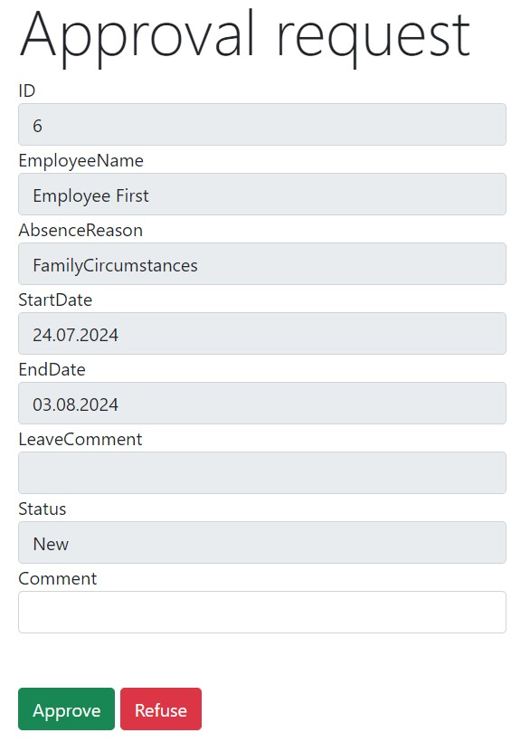
 
 
 

- Going to the Projects list, HR Manaegr will get all the projects involving employees who subordinate to him. The table provides general information 
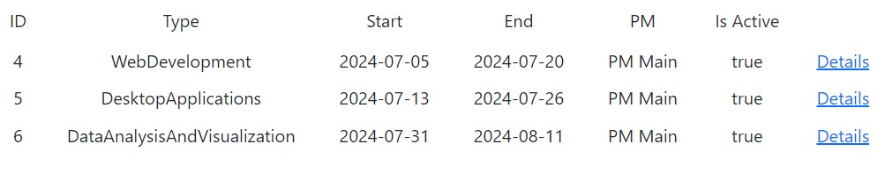
 
 
You can also follow the link in the last column of the table for more information. You do not have the right to make any changes.
 
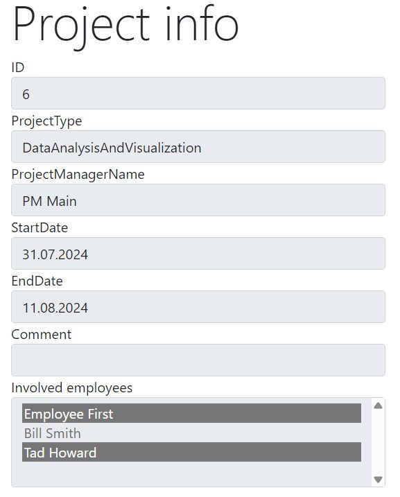
 
 

- The lists of Leave requests and Approvals to my leave requests for all roles that have access to it is the same and is described in the "General rules" section
 
 
 

Project Manager role
-

When logged in as an Project Manager, the following lists are available: Employees, Approval requests, Projects, Leave requests and Approvals to my leave requests.

- Going to the Employees list, the user will see a table with data similar to the Employees table for the HR Manager role, but without the ability to change the status.
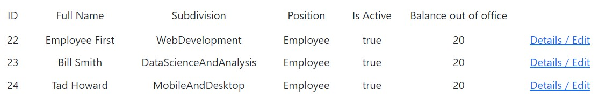
 
 
By clicking on the link for editing, only the field of projects in which the employee is involved will be available for change
 
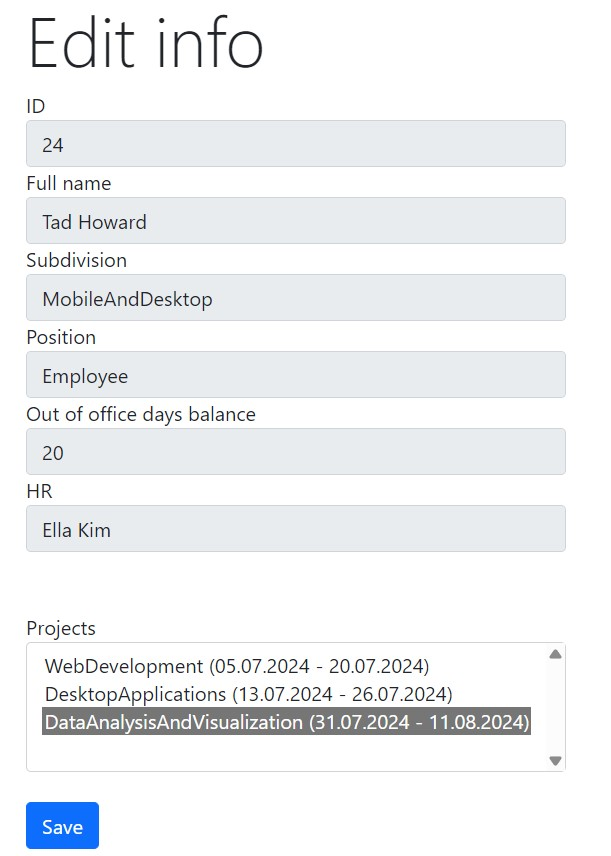
 
 
 

- The level of access to the Approval requests list for the Project Manager role is completely the same as for the HR Manager role. The rules for interacting with this section are described above in the "HR Manager role" section
 
 
 

- Going to the Projects list, the Project Manager will see a table with data similar to the data in the same table for the HR Manager role, but with the ability to change the status of any project by clicking on the yellow button in the Is Active column
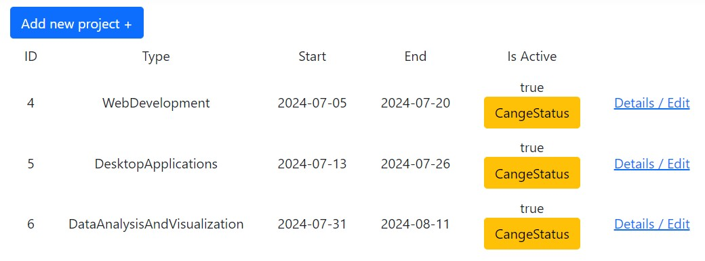
 
 
Also, by clicking on the link for editing, all fields except ID and ProjectManagerName are open for editing
 
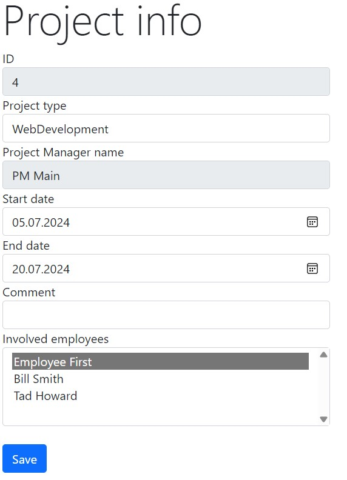
 
 
 
- The lists of Leave requests and Approvals to my leave requests for all roles that have access to it is the same and is described in the "General rules" section
 
 
 

Employee role
-

A user with the Employee role has access only to the Projects, Leave requests and Approvals to my leave requests lists.

- Going to the Projects list, the employee will see a table with the projects in which he or she is involved. The rules for interacting with this table for the Employee role are completely the same as for the HR Manager role and are described above in the "HR Manager role" section
 
 
- The lists of Leave requests and Approvals to my leave requests for all roles that have access to it is the same and is described in the "General rules" section
 
 
 

Administrator role
-
For administrators, the Employees, Leave requests and Approvals to my leave requests lists are available.

- Going to the Employees list, the user will see a table with all employees of the company. The general rules for interacting with this table for this role are the same as for the HR Manager role and are described above in the corresponding section. <b>Important!</b> User roles are open for editing, which means that the administrator can set and change the role of an employee, unlike HR Manager
 
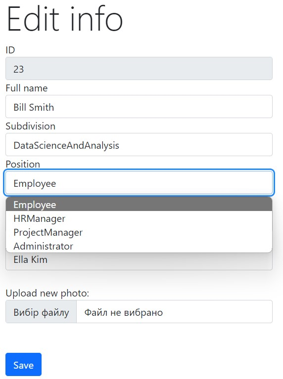
 
 
- The lists of Leave requests and Approvals to my leave requests for all roles that have access to it is the same and is described in the "General rules" section